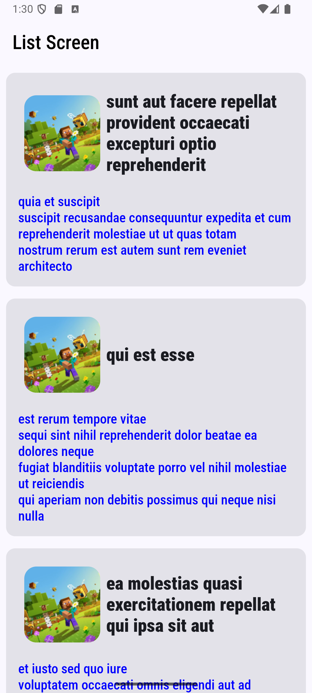
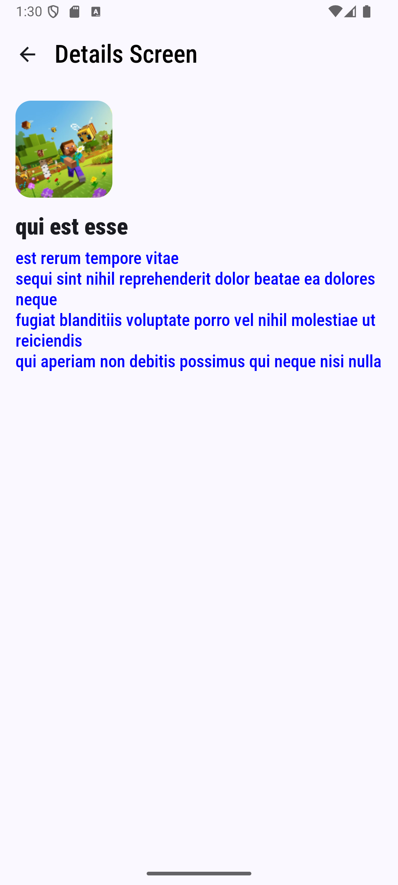
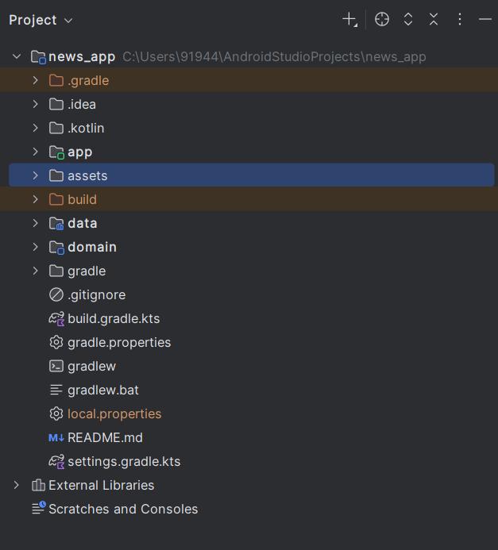

## Mobile App - Listing and Details Screens
A clean-architecture android mobile app in Kotlin, featuring Listing and Details screens, built with MVVM, Jetpack compose, Hilt for DI, Coroutines with StateFlow for reactive data flow, Coil for image loading and unit tests for ViewModel logic.

## Tech Stack
- Language : Kotlin
- UI : Jetpack Compose
- Architecture : Clean Architecture with MVVM (Model - View - ViewModel) pattern
- Dependency Injection : Hilt
- Concurrency : Kotlin Coroutines + StateFlow + Flow
- Networking : Retrofit with GSON for JSON parsing
- Image Loading : Coil
- Navigation : Jetpack Navigation Component for Compose
- Testing :  JUnit, Mockito(unit testing)

## Architecture Overview
- **Clean Architecture and MVVM**
The project follows Clean Architecture principles, dividing responsibilities into data, domain, and ui layers. This ensures separation of concerns, better testability, and modular code organization. ViewModels in the MVVM pattern act as the bridge between domain logic and the UI.
- **Multi-Module Project Structure**
Each layer (app, data and domain) is implemented as a separate Gradle module, enabling scalability, faster builds, and independent feature development
Declarative UI code with composable for the Listing and Details screen for concise, readable UIs.
- **Jetpack Compose for UI**
The UI layer is built entirely with Jetpack Compose, offering a declarative approach for building modern UIs. Listing and Detail screens are implemented as composable, ensuring concise, reusable, and reactive UI code.
- **Navigation**
Screen transitions are handled using the Jetpack Navigation Component for Compose, providing type-safe navigation and easier back-stack management.
- **Dependency Injection with Hilt**
Hilt simplifies dependency management by injecting ViewModels, repositories, and data sources across modules. Reusable bindings are defined in Hilt modules for consistency and testability.
- **Networking & Data Handling**
- Retrofit is used for network calls.
- Gson handles JSON serialization and deserialization.
- DTOs map API responses and are transformed into domain models before reaching the UI.
- **Coroutines + Flow/StateFlow**
- Asynchronous operations are managed with Kotlin Coroutines.
- Flow is used for data streams (e.g., network responses).
- StateFlow is used to expose and observe UI state, supporting reactive UI updates.
- **Error Handling & UI States**
A sealed class UIState represents Loading, Success, and Error scenarios, ensuring predictable state handling across the app.
- **Testing**
Unit Tests: Business logic and ViewModels are covered using JUnit and Mockito.

## Future Enhancements
- **Offline Support with Caching** : Add Room database or DataStore for local persistence and offline-first support.
- **Pagination** - Implement Jetpack Paging 3 for efficient loading of large datasets in the Listing Screen.
- **Error Handling and UI States**: Introduce a unified error handling mechanism with retry actions and user-friendly error message.
- **UI/UX Improvements** : 
- Enhance theming (dark mode, dynamic colors with Material 3).
- Improve accessibility features.
- Redesign splash screen and app icon.
- **API Integration Improvements** : Add support for multiple endpoints, authentication(OAuth/JWT) and secure API handling.
- **CI/CD Integration** : Automate build, test and deployment pipelines using GitHub Actions.
- **Internationalization** : Add multi-language support for wider usability.
- **Analytics & Crash Reporting** : Integrate Firebase Analytics / Crashlytics for monitoring app health and usage patterns.

### 📱 News Listing Screen

### 📱 News Details Screen

### 📂 Project Structure

